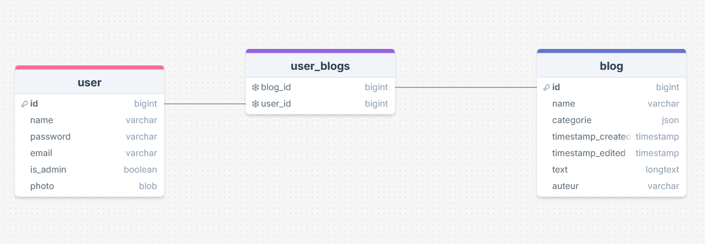
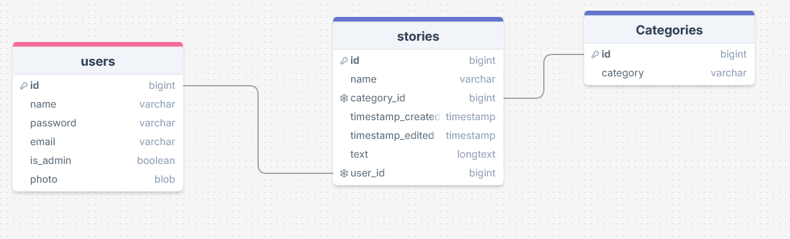

## Donderdag 9 Oktober

Installatie voor Laravel gedaan

## Maandag 13 Oktober

Ik heb eerst een schets gemaakt van hoe mijn ERD eruit moet zien. Daarna heb ik mijn user stories gemaakt
op basis van de functionaliteit die de website moet hebben.

## Users stories

- Als beheerder wil ik kunnen kijken welke verhalen er in de wacht staan om geactiveerd te worden.
- Als gebruiker wil ik verhalen kunnen plaatsen.
- Als gebruiker wil ik verhalen kunnen lezen.
- Als gebruiker wil ik verhalen onder categorieën selecteren.
- Als gebruiker wil ik verhalen kunnen zoeken op basis van zoekterm of titel.
- Als beheerder wil ik verhalen kunnen verwijderen.
- Als gebruiker wil ik verhalen onder categorieën kunnen plaatsen.

## Dinsdag 14 Oktober

De nieuwe ERD:

Daarnaast heb ik nog een paar componants aan gemaakt.

## Woensdag 15 Oktober

Veranderingen:

- models aangemaakt.
- stories aangemaakt in mijn database.
- detail pagina
- index pagina

## Donderdag 16 Oktober

Veranderingen:

- controllers aangemaakt
- routes aangemaakt
- views aangemaakt
- stories kunnen plaatsen
- stories kunnen lezen

## Zondag 19 Oktober

Veranderingen:

- stories kan je veranderen

## Woensdag 22 Oktober

Veranderingen:

- je kan nu stories verwijderen

## Vrijdag 24 Oktober

Veranderingen:

- je kan nu zoeken op stories
- je kan nu stories filteren op categorieën

## Zondag 26 Oktober

Veranderingen:

- je kan nu inloggen als beheerder
- je kan nu stories activeren als beheerder
- je kan nu stories deactiveren als beheerder
- je kan nu stories bekijken die in de wacht staan als beheerder

## Maandag 27 Oktober

Veranderingen:

- Auth systeem verbeterd

## Dinsdag 28 Oktober

Veranderingen:

- Frontend verbeterd met Tailwind CSS
- adminpage verbeterd
- images toegevoegd aan stories
- validatie toegevoegd aan forms voor de images
- tabs voor adminpage toegevoegd
- pending stories en active stories gescheiden in adminpage
- contact en about verbonden met de andere pagina's

## Woensdag 29 Oktober

Veranderingen:

- admin verwijdert nu ook de images van stories
- mystories pagina toegevoegd waar je al je eigen stories kan zien
- mystories pagina verbeterd met edit en delete knop
- route bescherming toegevoegd voor mystories pagina
- route bescherming toegevoegd voor edit en delete stories
